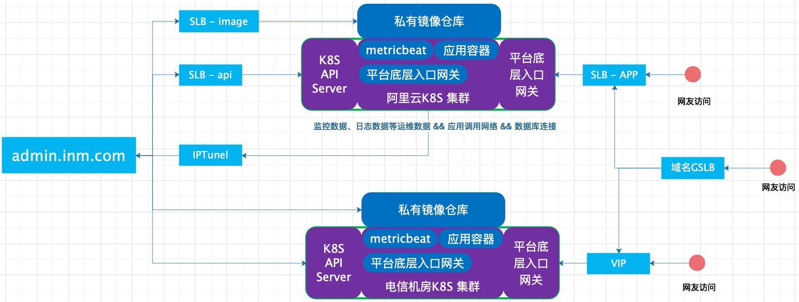

### 架构图



### 环境初始化

- **[Python](https://www.python.org/downloads/)** 2.7

```bash
pip install flask-restful
pip install Flask
pip install redis 
pip install kubernetes
pip install configparser
```


### 快速开始

```bash
python kubernetes_api.py
python K8S_TASK/Task_Daemon.py
```

